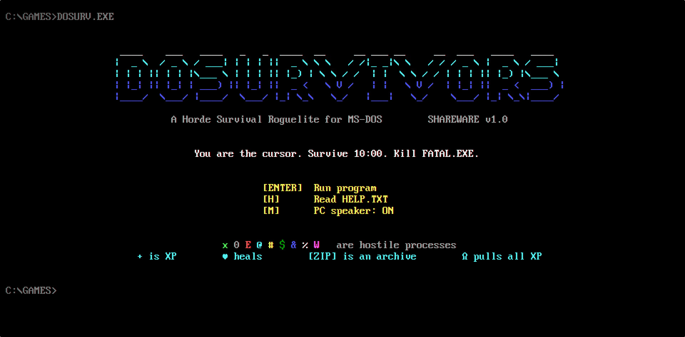
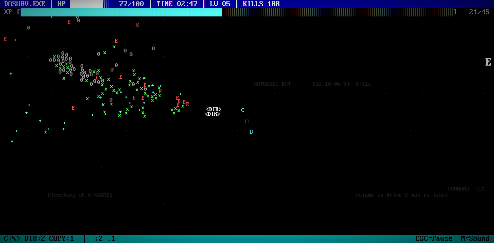
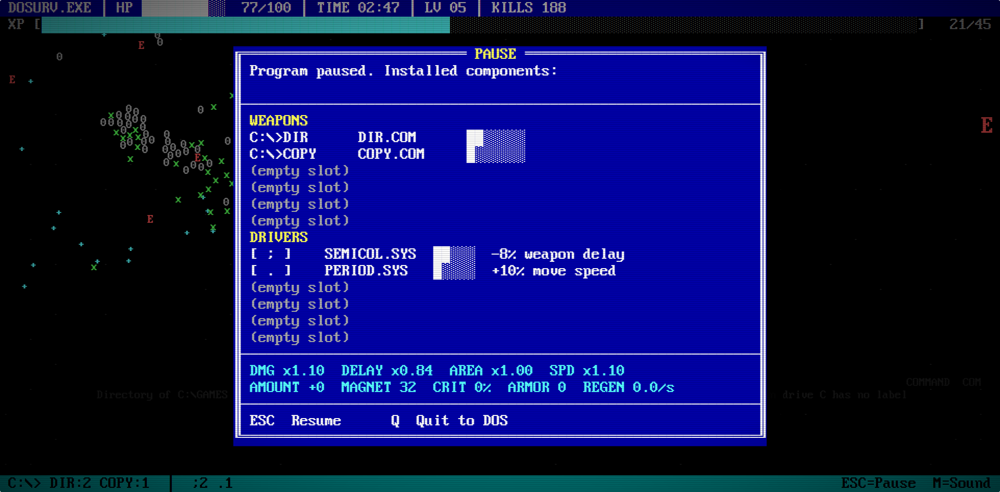
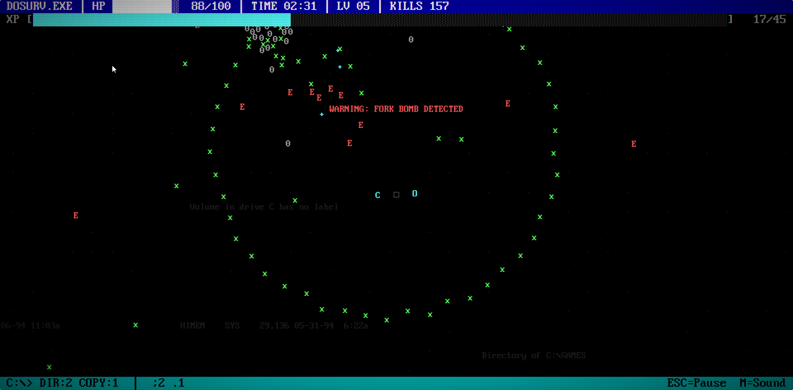
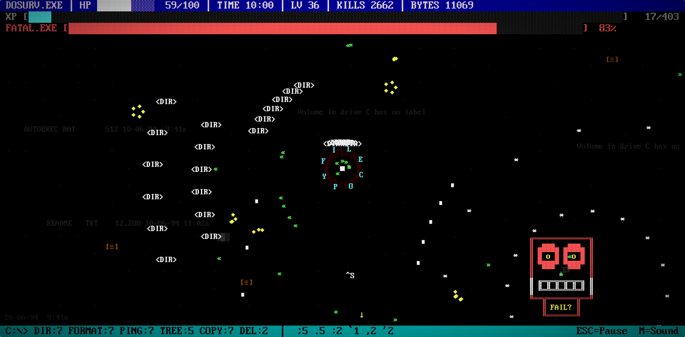
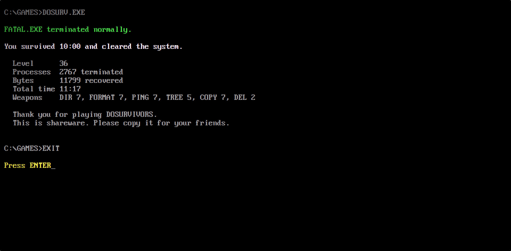

# DOSurvivors

A horde-survival roguelite that looks like MS-DOS. You are the blinking cursor, enemies are ASCII characters, your weapons are DOS commands and your upgrades are punctuation. Survive 10 minutes, then terminate the boss. Beat it to unlock the second drive, `D:\`.

> **Proof of concept.** DOSurvivors is a test project, not a finished game. Balance, features and content may change or stay rough, and bugs are expected.

## Play

**[Play in your browser](https://b4help.github.io/dosurvivors/)** (desktop or mobile).

DOSurvivors is a single `index.html` with no build step and no internet connection required.

- **Online:** the link above, hosted on GitHub Pages.
- **Locally:** download the repo and open `index.html` in a browser.
- **On a web server:** copy the folder to any static host.

Keep `Web437_IBM_VGA_8x16.woff` next to `index.html`. Without it the game falls back to Courier New and the box-drawing characters won't line up.

## Controls

| Action | Keyboard | Touchscreen |
|---|---|---|
| Move | WASD or arrow keys | On-screen stick in the bottom corner (switch left/right in the pause menu) |
| Pause (loadout and stats) | ESC or P | Tap the top or bottom bar |
| Pick an upgrade | 1-3, or W/S then ENTER, or click | Tap an option |
| Sound on/off | M | From the pause menu |
| Pick drive (after unlocking) | D on the title screen | Tap the Drive line |
| Help | H on the title screen | Tap "Read HELP.TXT" |

The game detects touchscreens on its own, shows the stick and switches the on-screen hints to match. On phones held upright, the level-up and pause boxes use a narrower layout with bigger text.

## How it plays

Enemies swarm in from every side and your weapons fire on their own. Kills drop XP (`+`). Each level pauses the game and **SETUP.EXE** offers three choices: a new weapon, a weapon level or a driver. Every minute gets harder, with elites, fork bombs and tougher enemy types. At 10:00 every enemy is terminated and **FATAL.EXE** loads. Kill it to win.

## Drives

DOSurvivors has two drives. **`C:\GAMES`** is the first run: survive 10 minutes and terminate **FATAL.EXE**. Beating it unlocks **`D:\`**, which is the same 10-minute run with these changes:

- **Walls.** Solid blocks scattered across the field. You, enemies and bullets can't cross them, and your shots stop at them. Walls are random every run.
- **New processes.** Trojan, keylogger and zip bomb (see below).
- **A new boss.** **CHKDSK.EXE**, with 45000 HP.
- **v2 weapons.** Every weapon has a stronger v2 version (DIR2, TYPE2, COPY2, DEL2, PING2, TREE2, DEFRAG2, FORMAT2). A v2 is offered as an upgrade. It replaces its base weapon in the same slot and keeps the level, with 1.6x damage and 20% faster firing.

Progress is saved in your browser's localStorage: the highest unlocked drive and your best run on each. Press **D** on the title screen to switch drives. The save belongs to one browser and one address, so a copy of the game at a different address starts with a fresh save.

### Weapons

You start with DIR. Hold up to 6, each upgrades to level 7.

| Command | Effect |
|---|---|
| `C:\>DIR` | Fires `<DIR>` listings at the nearest enemy |
| `C:\>TYPE` | Types a DOS error message across the screen like a whip |
| `C:\>COPY` | Copied files orbit around you |
| `C:\>DEL` | Damage aura that deletes anything too close |
| `C:\>PING` | Homing packets |
| `C:\>TREE` | Branches strike a random target and chain between enemies |
| `C:\>DEFRAG` | Drops fragmented blocks that grind enemies |
| `C:\>FORMAT` | Periodic expanding ring that formats everything around you |

### Drivers (punctuation upgrades)

Hold up to 6. Each goes to level 5 (COLON.SYS: level 2). Bonuses are per level.

| Driver | Bonus |
|---|---|
| `!` EXCLAIM.SYS | +10% damage |
| `;` SEMICOL.SYS | -8% weapon delay |
| `:` COLON.SYS | +1 projectile / orbit / strike |
| `.` PERIOD.SYS | +10% move speed |
| `,` COMMA.SYS | +30% pickup range |
| `"` QUOTES.SYS | +10% area |
| `'` APOSTR.SYS | +15% duration, +10% projectile speed |
| `?` QUERY.SYS | +6% critical chance (x2 damage) |
| `~` TILDE.SYS | +0.3 HP per second |
| `^` CARET.SYS | +20 max HP |
| `` ` `` BACKTICK.SYS | +1 armor |
| `_` UNDERSC.SYS | +10% XP gain |

When everything is maxed out, level-ups offer **MEM.EXE** instead, which restores 40 HP.

### Pickups and treasure

| Symbol | What it is |
|---|---|
| `+` | XP. Cyan, green, yellow, then magenta as the value goes up |
| `♥` | Heart: restores 30 HP |
| `Ω` | Magnet: pulls all XP and bytes to you |
| `♦` | Bytes: your score |
| `[ZIP]` | Archive dropped by elites: pick 1 upgrade for something you own |
| `[≡]` | .TMP file: walk over it for random loot |
| `░▒░` | Deleted file: stand on it to UNDELETE buried treasure (an upgrade choice, a bytes and XP shower, two power-ups, or a full heal) |
| `→` | Yellow arrows at the screen edge point to nearby buried treasure |

### Power-ups

| Symbol | Power-up | Effect |
|---|---|---|
| `»»` | TURBO | 10s: weapons fire 60% faster, you move 25% faster |
| `^S` | CTRL+S | 5s: enemies freeze and can't hurt you |
| `☼` | SCANDISK | Kills every normal enemy on screen and hurts elites and the boss |
| `◘` | WRITE PROTECT | 6s: you take no damage |

### Enemies and events

| Enemy | Name | First appears |
|---|---|---|
| `x` | bug | 0:00 |
| `0` | null ptr | 1:00 |
| `E` | error | 2:00 |
| `@` | worm | 3:00 |
| `#` | corrupt sector | 4:00 |
| `$` | memory leak | 5:00 |
| `&` | fork | 6:00 |
| `%` | overflow | 7:00 |
| `W` | boot virus | 8:00 |

- **Elites** appear at 0:45 and every minute after: big blinking enemies that drop a `[ZIP]`.
- **Fork bombs** at 2:30, 5:30 and 8:30: a ring of enemies closes in on you.
- **FATAL.EXE** loads at 10:00. Below half HP it adds a bullet spiral and spawns tougher minions.

### D:\ enemies and boss

| Enemy | Name | Notes |
|---|---|---|
| `q` | trojan | Fast, chases you hard |
| `k` | keylogger | Fires aimed shots every few seconds |
| `Z` | zip bomb | Tanky. Bursts into a ring of bullets when killed |

- **CHKDSK.EXE** loads at 10:00 on `D:\`. Fires radial bursts and aimed fans, and summons trojans. Below half HP it speeds up and adds a spiral.

Lose and you get `General failure reading drive C: Abort, Retry, Fail?`. Win and FATAL.EXE terminates normally.

## Files

| File | Purpose |
|---|---|
| `index.html` | The whole game: code, graphics, sound (generated in the browser) and screens |
| `Web437_IBM_VGA_8x16.woff` | IBM VGA 8x16 font for the DOS look |
| `FONT-LICENSE.txt` | The font's license |
| `images/` | Screenshots for this README |

## Credits

Font: **Px437 / Web437 IBM VGA 8x16** from [The Ultimate Oldschool PC Font Pack](https://int10h.org/oldschool-pc-fonts/) by VileR, licensed under [CC BY-SA 4.0](https://creativecommons.org/licenses/by-sa/4.0/). See `FONT-LICENSE.txt`.
